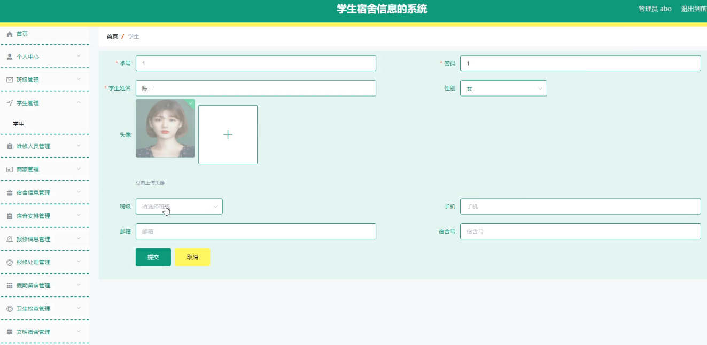
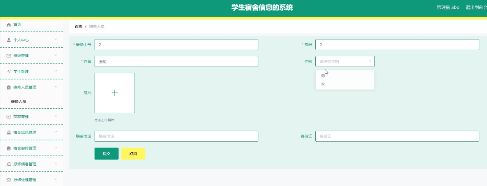
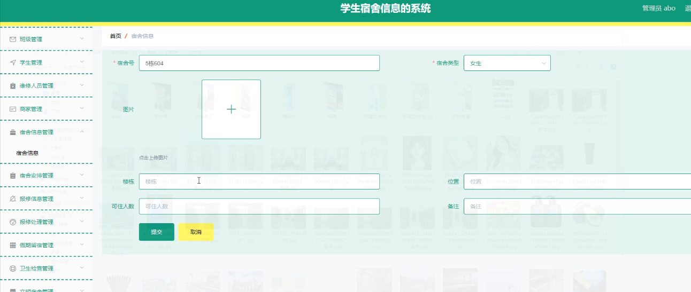
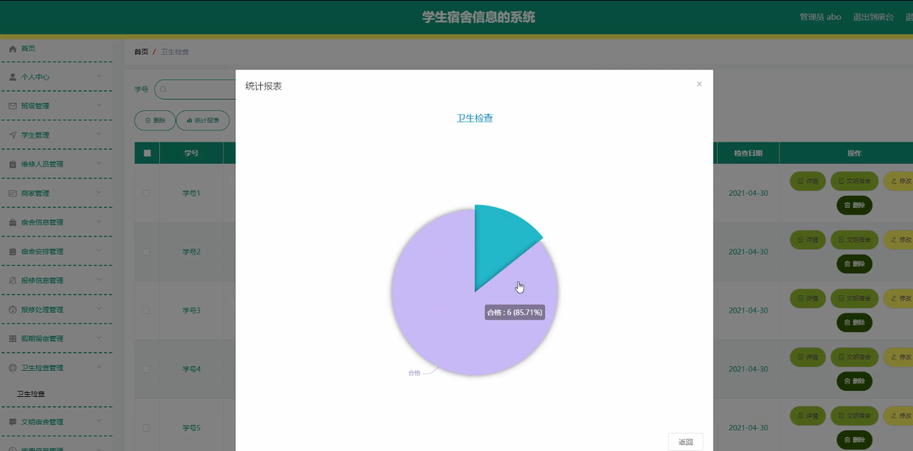
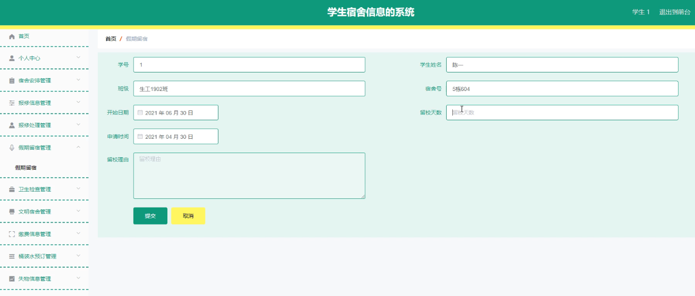
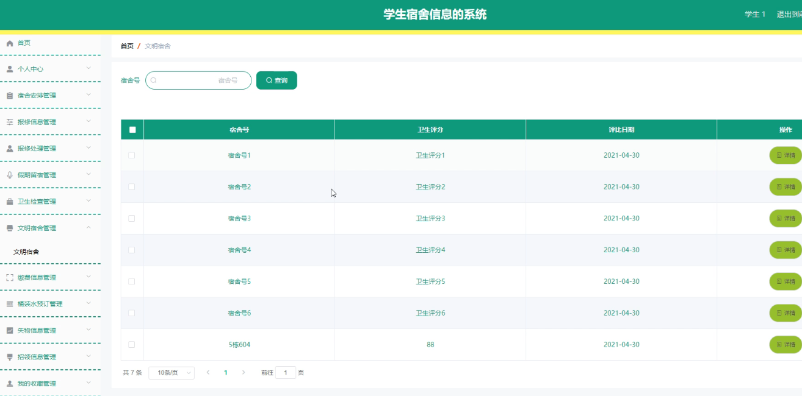
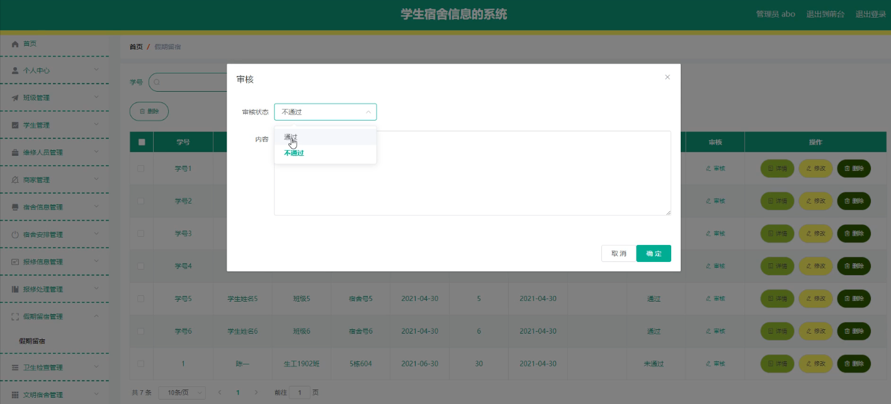

**项目简介：**  
本项目基于主流的前后端分离架构，采用 **SpringBoot + Vue 技术栈**，配套 **MySQL 数据库**，适用于毕业设计与课题实训开发。  
本人已整理了超 **4000 多套毕业设计源码+论文+开题报告+PPT...**，涵盖 **Java、SpringBoot、Vue、SSM、uni-app 小程序、PHP、Android** 等方向，支持功能修改定制与论文服务。  
**团队提供以下服务：**  
- 项目代码修改与调试  
- 数据库配置与远程协助  
- 论文定制与修改  
**获取更多的4000多套源码或SQL文件请联系：**  
- QQ：3906443360 微信：BesheHelp

# springboot095学生宿舍信息的系统

（1）班级信息的实体属性图如下：

图4.12  班级信息实体属性图

（2）宿舍信息实体属性图如图4.13所示：

图4.13  宿舍信息实体属性图

（3）管理员信息实体属性图如图4.14所示：

图4.14 管理员信息实体属性图

4.3.2数据库设计表

学生宿舍信息管理系统需要后台数据库，下面介绍数据库中的各个表的详细信息：

表4.1 班级

表4.2 报修处理

表4.3 报修信息

表4.4 失物信息评论表

表4.5 缴费信息

表4.6 假期留宿

表4.7 宿舍公告

表4.8 商家

表4.9 失物信息

表4.10 收藏表

表4.11 宿舍安排

表4.12 宿舍信息

表4.13 桶装水

表4.14 桶装水品牌

表4.15 桶装水预订

表4.16 管理员表

表4.17 卫生检查

表4.18 维修人员

表4.19 文明宿舍

表4.20 学生

表4.21 招领信息

5系统详细实现

5.1 学生信息管理

学生宿舍信息管理系统的系统管理员可以管理学生，可以对学生信息添加修改删除以及查询操作。具体界面的展示如图5.1所示。

图5.1 用户信息管理界面

5.2 维修人员管理

系统管理员可以查看对维修人员进行添加，修改，删除以及查询操作。具体界面如图5.2所示。

图5.2 维修人员管理界面

5.3 宿舍信息管理

管理员可以对宿舍信息进行添加，修改，删除以及查询操作。界面如下图所示：

图5.3 宿舍信息管理界面

5.4 卫生检查管理

管理员可以对卫生检查信息进行统计。界面如下图所示：

图5.4 卫生检查信息界面

5.5 学生假期留宿

学生登录可以申请假期留宿。界面如下图所示：

图5.5 学生假期留宿界面

5.6 文明宿舍信息

学生可以看到文明宿舍信息。界面如下图所示：

图5.6 文明宿舍界面

5.7 假期留宿审核

管理员可以对学生提交的假期留宿进行审核操作。界面如下图所示：

图5.7 假期留宿审核界面